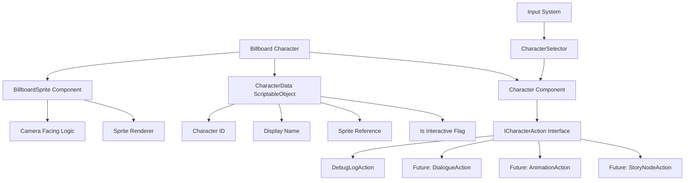

# Billboard Sprite Character System - Architecture Plan

## Overview

This system adds billboard sprite characters to the Unity project with a clean, extensible architecture that supports future features like dialogue, story nodes, and animations.

## System Architecture



## Core Components

### 1. BillboardSprite.cs

**Purpose**: Handles camera-facing behavior for sprites

- Updates rotation each frame to face main camera
- Simple, single-responsibility component
- Can be used independently of character system
- Supports both Y-axis only and full 3D billboarding

**Key Methods**:

- `LateUpdate()`: Rotates sprite to face camera

### 2. CharacterData.cs (ScriptableObject)

**Purpose**: Stores character properties as reusable assets

- Character ID (unique identifier)
- Display name
- Sprite reference
- Interactive flag
- Future: animation sets, dialogue trees, story node references

**Benefits**:

- Easy to manage multiple characters
- Can be created/edited in Unity Inspector
- Supports asset reuse and variants

### 3. ICharacterAction.cs (Interface)

**Purpose**: Defines contract for all character actions

```csharp
public interface ICharacterAction
{
    void Execute(Character character);
}
```

**Design Pattern**: Strategy Pattern

- Extensible action system
- Future actions can be added without modifying existing code
- Supports composition of multiple actions
- Actions can be MonoBehaviours for Unity Inspector integration

### 4. Character.cs (MonoBehaviour)

**Purpose**: Main character component that coordinates all character functionality

- References CharacterData
- Manages list of ICharacterAction components
- Handles interaction triggers
- Coordinates between billboard, data, and actions

**Key Features**:

- Automatically finds and caches action components
- Exposes interaction method for external systems
- Provides character state information

### 5. CharacterSelector.cs

**Purpose**: Handles player input for character interaction

- Raycast-based character selection
- Detects mouse clicks on characters
- Triggers character interactions
- Works with Unity's Input System

**Key Features**:

- Layer-based filtering for performance
- Visual feedback on hover (optional)
- Supports both mouse and touch input

### 6. Example Actions

#### DebugLogAction.cs

**Purpose**: Simple test action that logs to console

- Demonstrates action pattern
- Useful for testing and debugging
- Shows how to access character data

**Future Actions** (to be implemented later):

- **DialogueAction**: Triggers dialogue system
- **AnimationAction**: Plays sprite animation
- **StoryNodeAction**: Activates story graph nodes
- **SoundAction**: Plays audio on interaction
- **EventAction**: Triggers Unity Events

## File Structure

```
Assets/
├── Scripts/
│   └── Characters/
│       ├── Core/
│       │   ├── BillboardSprite.cs
│       │   ├── Character.cs
│       │   └── CharacterData.cs
│       ├── Actions/
│       │   ├── ICharacterAction.cs
│       │   └── DebugLogAction.cs
│       └── Input/
│           └── CharacterSelector.cs
├── Prefabs/
│   └── Characters/
│       ├── InteractiveCharacter.prefab
│       └── DecorativeCharacter.prefab
└── Data/
    └── Characters/
        └── (CharacterData ScriptableObject assets)
```

## Key Design Decisions

### 1. Action Pattern over Hard-coded Behaviors

**Why**: Maximum flexibility for future features

- Uses `ICharacterAction` interface for extensibility
- Actions can be added/removed at runtime
- Easy to add new action types without modifying core code
- Supports your planned features: dialogue, story nodes, animations
- Actions are MonoBehaviours so they can be configured in Inspector

### 2. ScriptableObject for Character Data

**Why**: Separation of data from behavior

- Separates data from behavior logic
- Easy to create character variants
- Can be edited in Unity Inspector
- Supports asset reuse (same character in multiple scenes)
- Can be loaded/unloaded dynamically

### 3. Modular Components

**Why**: Reusability and maintainability

- Billboard behavior is separate from character logic
- Can reuse billboard for other objects (signs, UI elements, props)
- Character interaction is optional (decorative vs interactive)
- Each component has single responsibility

### 4. Input System Integration

**Why**: Consistency with existing project

- Uses raycasting for 3D world interaction
- Compatible with existing Input System setup
- Can be extended for touch input, gamepad, etc.
- Centralized input handling in CharacterSelector

## Implementation Strategy

### Phase 1: Core Billboard System

1. Create [`BillboardSprite.cs`](Assets/Scripts/Characters/Core/BillboardSprite.cs)
2. Test with simple sprite in scene
3. Verify camera-facing behavior works correctly

### Phase 2: Character Foundation

1. Create [`CharacterData.cs`](Assets/Scripts/Characters/Core/CharacterData.cs) ScriptableObject
2. Create [`Character.cs`](Assets/Scripts/Characters/Core/Character.cs) component
3. Link billboard + data + sprite renderer

### Phase 3: Interaction System

1. Create [`ICharacterAction.cs`](Assets/Scripts/Characters/Actions/ICharacterAction.cs) interface
2. Create [`DebugLogAction.cs`](Assets/Scripts/Characters/Actions/DebugLogAction.cs) example
3. Create [`CharacterSelector.cs`](Assets/Scripts/Characters/Input/CharacterSelector.cs) for input

### Phase 4: Polish & Examples

1. Create prefabs for interactive/decorative characters
2. Add visual feedback (highlight on hover - optional)
3. Create example character data assets
4. Write usage documentation

## Future Extensibility

This architecture easily supports your planned features:

### Story System Integration

```csharp
public class StoryNodeAction : MonoBehaviour, ICharacterAction
{
    [SerializeField] private string nodeId;

    public void Execute(Character character)
    {
        // Activate story node when character is clicked
        StoryManager.Instance.ActivateNode(nodeId);
    }
}
```

### Dialogue System Integration

```csharp
public class DialogueAction : MonoBehaviour, ICharacterAction
{
    [SerializeField] private DialogueTree dialogueTree;

    public void Execute(Character character)
    {
        // Start dialogue when character is clicked
        DialogueManager.Instance.StartDialogue(dialogueTree);
    }
}
```

### Animation System

```csharp
public class SpriteAnimationAction : MonoBehaviour, ICharacterAction
{
    [SerializeField] private Sprite[] animationFrames;
    [SerializeField] private float frameRate = 10f;

    public void Execute(Character character)
    {
        // Play sprite animation on click
        character.PlayAnimation(animationFrames, frameRate);
    }
}
```

### Composite Actions

```csharp
// Multiple actions can be added to same character
// They will all execute in sequence when character is clicked
GameObject character = new GameObject("NPC");
character.AddComponent<DebugLogAction>();
character.AddComponent<SpriteAnimationAction>();
character.AddComponent<StoryNodeAction>();
```

## Code Style Guidelines

Following existing codebase patterns:

- Clean, minimal code
- Clear naming conventions (PascalCase for public, \_camelCase for private)
- `[SerializeField]` for Unity Inspector exposure
- Event-driven architecture where appropriate
- Single responsibility principle
- No unnecessary abstractions

## Example Usage

### Creating an Interactive Character

1. **Create CharacterData asset**:
   - Right-click in Project → Create → Characters → Character Data
   - Set ID: "npc_merchant"
   - Set Display Name: "Merchant"
   - Assign sprite
   - Check "Is Interactive"

2. **Add Character to scene**:
   - Create empty GameObject
   - Add `Character` component
   - Assign CharacterData
   - Add `BillboardSprite` component
   - Add `DebugLogAction` component (or other actions)

3. **Character is now clickable** and will execute all attached actions

### Creating a Decorative Character

1. **Create CharacterData asset**:
   - Set ID: "bg_person_01"
   - Set Display Name: "Background Person"
   - Assign sprite
   - Uncheck "Is Interactive"

2. **Add Character to scene**:
   - Create empty GameObject
   - Add `Character` component
   - Assign CharacterData
   - Add `BillboardSprite` component
   - No action components needed

3. **Character will face camera** but won't respond to clicks

### Using Prefabs

Once prefabs are created:

```
1. Drag InteractiveCharacter.prefab into scene
2. Assign CharacterData in Inspector
3. Configure actions as needed
4. Done!
```

## Technical Considerations

### Performance

- Billboard updates in `LateUpdate()` for smooth camera following
- Raycast uses layer masks to avoid unnecessary checks
- Character actions are cached on Start() to avoid GetComponent calls

### Compatibility

- Works with Unity 6000.3.9f1
- Compatible with URP (Universal Render Pipeline)
- Uses Unity's Input System (already in project)
- No external dependencies required

### Extensibility Points

1. **ICharacterAction**: Add new action types
2. **CharacterData**: Add new properties via inheritance or composition
3. **CharacterSelector**: Extend for different input methods
4. **BillboardSprite**: Add constraints or animation options

## Testing Strategy

### Manual Testing

1. Create test character with DebugLogAction
2. Verify billboard faces camera from all angles
3. Test clicking character triggers action
4. Test decorative character doesn't respond to clicks
5. Test multiple actions on same character

### Future Automated Testing

- Unit tests for action execution
- Integration tests for character interaction flow
- Performance tests for many characters in scene

## Documentation Deliverables

1. This architecture document
2. Code comments in all scripts
3. README with quick start guide
4. Example scene with sample characters
5. Inspector tooltips for public fields

---

## Summary

This architecture provides:

- ✅ Clean, simple code
- ✅ Extensible action system for future features
- ✅ Easy to create character variants
- ✅ Supports both interactive and decorative characters
- ✅ Follows existing project patterns
- ✅ Ready for vertical slice development
- ✅ Minimal dependencies
- ✅ Clear separation of concerns

The system is designed to grow with your project while maintaining simplicity and clarity.
